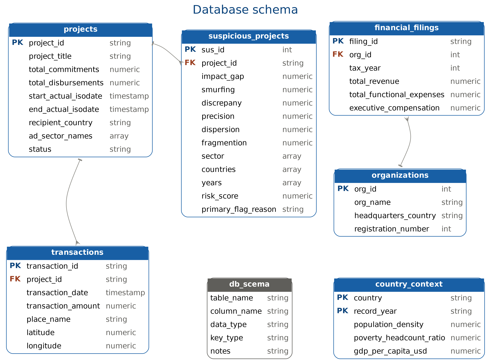

# 🔍 Donation Integrity & Investigation Program (DIIP)

## 📖 Description
An end-to-end data engineering and investigative analytics platform designed to audit global aid flows, detect financial anomalies, and visualize geographical risk using **PostgreSQL** and **Apache Superset**. This project extracts massive datasets, cleans and engineers them into relational models, and passes them through a custom algorithmic engine to uncover financial manipulation tactics such as "Fragmentation" and "Smurfing."

## ⚠️ The Problem
**The $6 Billion Question:** Every year, billions are pledged to global development and relief, but do these funds actually reach their intended destinations? 
This project exposes a staggering deficit between massive financial commitments (over $6.22 Billion) and actual disbursements (only $1.23 Million). The core issues lie in a lack of transparency, funds evaporating into astronomical administrative overheads, and active manipulation through project fragmentation to evade audits.

---

## ⚙️ Workflow

### 1️⃣ Ask (Formulation & Planning)
The project revolved around one core question: *"Are global funds actually reaching their intended destinations?"*
To answer this, a data pipeline was designed to integrate three primary sources to uncover the truth:
*   **Organizational & Financial Data:** Via the ProPublica API.
*   **Macroeconomic Context:** Via the World Bank API.
*   **Geospatial Transaction Data:** Massive CSV files for projects and transactions sourced from AidData.

### 2️⃣ Prepare (Data Ingestion & Staging)
Data preparation was executed in 5 foundational stages to build the Data Warehouse:
1.  **ProPublica Extraction:** Fetched NGO financial filings using `propublica_extractor.py`.
2.  **World Bank Extraction:** Extracted economic indicators (GDP, Poverty, Population) using `worldbank_extractor.py`.
3.  **Data Normalization:** Structured AidData CSVs into normalized relational staging tables.
4.  **Suspicious Projects Registry:** Built a dedicated table to evaluate and score projects based on anomaly indicators.
5.  **Metadata Documentation (`db_schema`):** Created a comprehensive inventory table mapping the full database schema and data types.

### 3️⃣ Process (Transformation & Scoring)
Data transformation and processing were handled entirely within PostgreSQL via the `DIIP.sql` script:
*   **Data Cleaning:** Applied `TRIM()` across all textual columns to resolve whitespace inconsistencies.
*   **Type Casting:** Corrected and altered column data types using `ALTER COLUMN`.
*   **Array Conversion:** Converted delimited text into native PostgreSQL arrays (`TEXT[]`) using `string_to_array` for advanced analytics.
*   **Risk Scoring Engine:** Executed a Min-Max Normalization algorithm to calculate risk scores (0 to 10) across multiple factors: financial gaps, smurfing, geographic dispersion, and sectoral fragmentation.

### 4️⃣ Analyze (Visualization & Storytelling)
The analysis transitioned to **Apache Superset** to build an interactive dashboard that tells an investigative data story.

**Key Investigative Visualizations:**
*   **Commitments vs. Disbursements (Bar Chart):** Highlights the massive gap between billions pledged and millions disbursed.
*   **Economic Status vs. Total Funding (Scatter Plot):** Proves that funding is often randomly distributed, ignoring the actual GDP of recipient nations.
*   **Average Financial Efficiency (Bar Chart):** Exposes organizations with astronomical administrative overhead ratios absorbing donation funds.
*   **Breakdown of Suspicion Metrics (Donut Chart):** Reveals manipulation tactics, primarily "Fragmentation" (61.34%) and "Smurfing" (36.93%).
*   **Project Title Keywords (Word Cloud):** Utilizes `to_tsvector` to extract vague and repetitive terms used to obscure project deliverables.
*   **Geographical Risk (Deck.gl Map):** Spatially tracks high-risk transactions to pinpoint geographical hubs of financial vulnerability.

---

## 🚧 Roadblocks & Challenges
*   **Cloud Hosting Constraints:** Encountered "403 Forbidden" errors when attempting to host Superset via Docker on platforms like Preset and Hugging Face. Shifted to a robust, Code-First Reproducible approach instead of a live server.
*   **Geospatial Complexity:** Handled thousands of incomplete geographic coordinates (Lat/Lon) and filtered them using PostgreSQL to render an accurate Deck.gl spatial map.
*   **API Timeouts:** Faced unstable responses from the World Bank API, which was mitigated by engineering a robust retry mechanism and extended timeouts in Python.

---

## 🌟 Features & Strengths
*   **Custom Risk Engine:** Automates the detection of financial manipulation and categorizes projects programmatically, moving beyond manual analysis.
*   **Automated ETL Pipelines:** Securely extracts data from APIs and injects it into the database while hiding credentials.
*   **NLP in SQL:** Leverages PostgreSQL's native full-text search functions (`to_tsvector` & `ts_stat`) to perform high-speed text mining on thousands of records for the word cloud.
*   **Total Reproducibility:** This project is not just static images; it is a fully reproducible environment that any engineer can clone, import, and run.

---

## 🛠️ Skills Demonstrated
*   **Hard Skills:** Data Engineering (Python, Pandas), ETL Pipelines, API Integration, Relational Database Design (PostgreSQL), Advanced SQL (Window functions, CTEs, Data Type Casting), Apache Superset, Geospatial Analysis (Deck.gl).
*   **Soft Skills:** Data Storytelling, Problem Solving, Investigative Critical Thinking, Adaptability (pivoting from cloud failures to engineering solutions).

---

## 🚀 How to Reproduce
To rebuild this project in your local environment:
1.  **Extract Raw Data:** Run the Python ETL scripts to populate your database:
    *   Execute `worldbank_extractor.py` for economic indicators.
    *   Execute `propublica_extractor.py` for organizational filings.
2.  **Build Schema & Engine:** Execute the `DIIP.sql` file in your PostgreSQL environment to construct tables, clean data, and trigger the risk-scoring algorithms.
3.  **Setup Dashboard:** Open your local Apache Superset instance, navigate to *Import Dashboards*, and upload the `dashboard_export_20260908T134737 (2).zip` file to clone the fully configured dashboard.

---

## 📁 Repository Contents
*   `worldbank_extractor.py` & `propublica_extractor.py`: Python ETL scripts for API data extraction and secure database ingestion.
*   `DIIP.sql`: The core database script containing DDL, data cleaning, and the anomaly risk-scoring engine.
*   `diip_dashborad.sql`: A curated file containing the pure SQL queries powering the Apache Superset charts.
*   `dashboard_export_20260908T134737 (2).zip`: The exported YAML configuration bundle to instantly reproduce the dashboard in Superset.
*   `DIIP_Investigative_Story (1).pptx`: A presentation (Case Study) detailing the complete investigative data story for stakeholders.

---

## 🔭 Future Scope
*   **Machine Learning Integration:** Implement predictive Python models to forecast suspicious projects proactively rather than relying on static algorithms.
*   **Real-time Data Streaming:** Orchestrate the pipeline using Apache Airflow to schedule and automate daily data extraction.

---

## 👨‍💻 About the Author
**Tariq Zeyad Jawad (Villam)**
*Data Engineer | Data Analyst | Physicist*
I bridge the gap between computational physics, mathematical precision, and data engineering to solve complex problems and craft data-driven investigative stories.

📫 **Contact Me:**
*   **Email:** tariq.z.jawad4@gmail.com
*   **LinkedIn:** [Tariq Jawad](https://www.linkedin.com/in/tariq-jawad?utm_source=share_via&utm_content=profile&utm_medium=member_android)
*   **GitHub:** [https://github.com/TariqZJawad](https://github.com/TariqZJawad)
